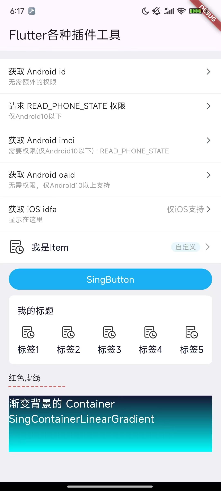

# flutter 插件、工具


### 安装

在项目的 `pubspec.yaml` 中添加：

```
dependencies:
  sing_plugin_tools: ^0.0.23
```

### 说明

本项目集成了以下三方插件：  

```
  get: ^4.6.5
  logger: ^2.3.0 # 日志打印
  get_storage: ^2.0.3 # 本地存储插件get_storage,https://pub.dev/packages/get_storage
  flutter_screenutil: ^5.9.0
  dio: ^5.4.3+1
  flutter_easyloading: ^3.0.5 # https://pub.dev/packages/flutter_easyloading loading窗口
  cached_network_image: ^3.4.1 # 带缓存的图片加载，https://pub.dev/packages/cached_network_image
```

### 效果图



### API

* 获取 androidId (仅支持 Android)

    ```
    String androidId = await FlutterPluginTools().getAndroidID() ?? '-1';
    ```

* 请求手机状态权限，仅支持 Android，Android10以上无法获取

    ```
    var t = await FlutterPluginTools().requestPhoneState() ?? '-1';  
    var phoneState = int.tryParse(t) ?? 0; // // 权限状态，-1是不可获取，0是拒绝，1是通过
    ```

* 请求 imei ，仅支持 Android，Android10 以上无法获取

    ```
    String androidImei = await FlutterPluginTools().getAndroidImei() ?? '-1';
    ```

* 请求 oaid，仅支持 Android，Android10 以下可能无法获取

    ```
    String androidOaid = await FlutterPluginTools().getAndroidOaid() ?? '-1';
    ```

* 请求 idfa，仅支持 iOS，记得添加权限

    ```
    // -1:.denied,-2:.notDetermined,-3:.restricted
    String idfa = await FlutterPluginTools().getIosIdfa() ?? '-1'; 
    ```

* 获取 PackageInfo

    ```
    // appName,packageName,version,buildNumber,buildSignature,installerStore,
    PackageInfo packageInfo = await _flutterPluginToolsPlugin.getPackageInfo();
    ```

* 获取 DeviceInfo

    ```
    DeviceInfoAndroid deviceInfoTemp = await SingPluginTools().getDeviceInfoAndroid();
    DeviceInfoIos deviceInfoTemp = await SingPluginTools().getDeviceInfoIos();
    ```

* 创建通用列表项

  ```
  import 'package:sing_plugin_tools/widgets/sing_cell_item.dart';

  SingCellItem(
    backgroundColor: Colors.white, // 背景颜色，默认透明
    height: 56.0, // item 的高度
    padding: const EdgeInsets.symmetric(horizontal: 16.0),
    // assetPath: 'assets/images/ic_feedback.png', // 前面 icon 的 asset 路径，为空则不展示
    iconSize: const Size(28.0,28.0), // 前面 icon 的大小，assetPath 为空则不展示
    gap: 12.0, // icon 和标题的间距
    title: '我是Item', // 标题
    titleTextStyle: const TextStyle(color: Color(0xFF131732), fontSize: 16.0), // 标题样式
    decoration: const BoxDecoration(border: Border(bottom: BorderSide(color: Colors.grey, width: 0.2))), // 边框的样式，默认底部一条线
    onTap: ()=> print('点击主标题'), // item 的点击事件
    // separator: Container(width: 200.0,height: 1.0,color: Colors.grey), // 自定义的装饰，正常是一根线，在 decoration 满足不了的情况下自定义，比如项左右有边距。当然其他 widget 也可以
    showNext: true, // 是否显示右侧箭头
    nextIcon: const Icon(Icons.arrow_forward_ios,size: 16.0,color:Colors.grey), // 右侧的箭头，可以是任何 Widget

    showSub: false, // 是否显示副标题，副标题是一个 TextField
    focusNode: FocusNode(), // 控制副标题的副控件 KeyboardListener
    controller: textController, // TextField 的 controller ，可以设置文字，取值也通过他
    subTitleTextStyle : const TextStyle(color: Color(0xFF131732), fontSize: 14.0), // 副标题样式
    subTitleHint: '请输入副标题', // 副标题的提示语
    subTitleHintTextStyle : const TextStyle(color: Colors.grey, fontSize: 14.0),// 副标题的提示语的样式
    subTitleContentPadding : const EdgeInsets.symmetric(vertical: 12.0), // 副标题的 ContentPadding
    readOnly:false, // 副标题 TextField 的是否能编辑
    onSubTap: ()=> print('点击副标题'), // 副标题点击事件
    customWidget: Container( // 自定义的 Widget ，在副标题之后，箭头之前，自己控制间距
      decoration: const BoxDecoration(
          color: Color(0xffE9F7FE),
          borderRadius: BorderRadius.all(Radius.circular(8.0))
      ),
      margin: const EdgeInsets.symmetric(horizontal: 5.0),
      child: const Text('  自定义  ',style: TextStyle(color: Colors.grey,fontSize: 12.0))
    )
  ),
  ```

* 通用按钮

  ```
  import 'package:sing_plugin_tools/widgets/sing_button.dart';

  SingButton(
    title : 'SingButton', // 按钮文字
    titleTextStyle : const TextStyle(color: Colors.white,fontSize: 16.0), // 按钮样式
    fillColor : const Color(0xFF19B1F4),   // 填充颜色
    highlightColor : const Color(0x40CCCCCC), // 按下颜色
    size : const Size(88.0,36.0), // 按钮大小
    elevation : 0, // 阴影
    highlightElevation : 0, // 按下阴影
    side : const BorderSide(color: Colors.transparent,width: 0.2), // 边框
    // sideColor : Colors.transparent, // 传 side 后无效
    // sideWidth : 0.2, // 传 side 后无效
    borderRadius : const BorderRadius.all(Radius.circular(20.0)), // 样式
    // radius : 20.0,  // 传 borderRadius 后无效
    padding: const EdgeInsets.symmetric(horizontal: 12.0,vertical: 3.0),
    margin: EdgeInsets.zero,
    onPressed : ()=> { }, // 点击事件
    onLongPress : ()=> debugPrint('SingButton Long Clicked'),
  ),
  ```

* 类似 Gird 的图片+文字，支持小标题

  ```
  var list = [
    ImgTxtBean('assets/images/example.png', '标签1', onTap: () => debugPrint('标签1')),
    ImgTxtBean('assets/images/example.png', '标签2', onTap: () => debugPrint('标签2')),
    ImgTxtBean('assets/images/example.png', '标签3', onTap: () => debugPrint('标签3')),
    ImgTxtBean('assets/images/example.png', '标签4', onTap: () => debugPrint('标签4')),
    ImgTxtBean('assets/images/example.png', '标签5', onTap: () => debugPrint('标签5')),
  ];
  SingImgTxtItem(
    list,
    title: '我的标题',
    titleGap: 15.0,
    gap: 6.0,
    margin: const EdgeInsets.symmetric(horizontal: 15.0),
    padding: const EdgeInsets.all(15.0),
    iconSize: const Size(25.0,25.0),
    crossAxisCount:5,
  );
  ```

* EventBusUtil

  ```
  EventBusUtil.singleton.send('aaa');
  ```
  
* LogUtil

  ```
  Log.init(true); // 是否开启日志打印
  Log.e('test')
  ```

* SpUtil

  ```
  SpUtil.init(SpUtil.spKey);
  SpUtil.write('key', 'value');
  SpUtil.read('key', 'defaultValue');
  ```

* SingUtil

  ```
  // 各种工具
  SingUtil.maskPhone('13111111111'); // 手机号中间4位用 * 代替，返回 131****1111
  ```

* SingDashedLine

  ```
  SingDashedLine(
    color: Colors.red,
    dashWidth: 5.0,
    dashSpace: 3.0,
    width: 100.0,       // 可选参数，默认为200.0
  )
  ``` 
  
* SingContainerLinearGradient 渐变背景

  ```
  SingContainerLinearGradient(
    width: Get.width - 30.w,
    height: 100.0,
    colors: [AppColor.main, const Color(0xff00ffff)],
    begin: Alignment.topCenter,
    end: Alignment.bottomCenter,
    child:Text('SingContainerLinearGradient',style: text_white_18)
  )
  ```
  
* SingImage
  
  ```
  SingImage('images/image.webp',width: 40.w),
  SingImage('images/image.webp',width: 40.w,cornerRadius:8.w),
  SingImage('images/image.webp',width: 40.w - 2.w,cornerRadius:8.w,borderWidth: 1.w,borderColor: AppColor.green),
  SingImage('images/image.webp',width: 40.w,isCircle: true),
  SingImage('images/image.webp',width: 40.w - 2.w,isCircle: true,borderWidth: 1.w,borderColor: AppColor.green),
  SingImage('https://xxx.png',width: 40.w,isCircle: true),
  SingImage('https://xxx.png',width: 40.w - 2.w,isCircle: true,borderWidth: 1.w,borderColor: AppColor.green),
  ```

### 后续工具继续补充...